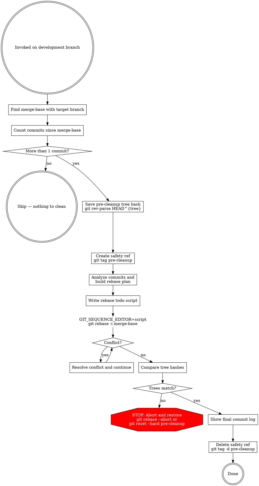

# Clean Branch History

## Overview

Reorganize a development branch's commits into clean, logical units before merging. Feedback-driven fixes, reverted experiments, and "fix based on review" commits become coherent history.

**Core principle:** Only history changes, never code. Tree hash before and after must be identical.

## Process



## Steps

### 1. Identify commits

If a caller passed `--base <sha>`, use it. Otherwise, auto-detect the trunk.

```bash
TRUNK_REF=$(git symbolic-ref refs/remotes/origin/HEAD 2>/dev/null)
if [ -n "$TRUNK_REF" ]; then
  MERGE_BASE=$(git merge-base HEAD "$TRUNK_REF")
else
  TRUNK_REF=""
  git show-ref --verify --quiet refs/heads/main    && TRUNK_REF=refs/heads/main
  [ -z "$TRUNK_REF" ] && git show-ref --verify --quiet refs/heads/master          && TRUNK_REF=refs/heads/master
  [ -z "$TRUNK_REF" ] && git show-ref --verify --quiet refs/remotes/origin/main   && TRUNK_REF=refs/remotes/origin/main
  [ -z "$TRUNK_REF" ] && git show-ref --verify --quiet refs/remotes/origin/master && TRUNK_REF=refs/remotes/origin/master
  if [ -z "$TRUNK_REF" ]; then
    echo "Cannot determine trunk. Pass base SHA explicitly via --base <sha>." >&2
    exit 1
  fi
  MERGE_BASE=$(git merge-base HEAD "$TRUNK_REF")
fi

git log --oneline $MERGE_BASE..HEAD
```

If there is only 1 commit, skip — nothing to clean up. Report "Single commit, no cleanup needed" and exit.

### 2. Save tree hash and create safety ref

```bash
TREE_BEFORE=$(git rev-parse HEAD^{tree})
git tag pre-cleanup HEAD
```

The tree hash captures the exact file contents. The tag provides a named recovery point.

### 3. Analyze and build rebase plan

Review each commit and determine its role:

- **Standalone feature/change** — `pick`, possibly `reword` if the message is vague
- **Fix for a prior commit** (typo fix, feedback fix, prop rename) — `fixup` into the commit it fixes
- **Reverted experiment** (try X + revert X) — `fixup` both into the nearest related commit. **Never `drop`** — dropping can change the tree if later commits don't fully undo the change
- **Test fix tied to a code change** — `fixup` into the commit that caused the test change
- **Vague "review feedback" commit** — `fixup` into the most relevant prior commit

**Commit message guidelines for reworded/surviving commits:**
- Describe *what* the commit delivers, not how it got there
- No "fix based on feedback", "address review comments", "try different approach"
- Match the project's existing commit message style

### 4. Execute the rebase

Write a shell script that replaces the rebase todo, then run:

```bash
cat > /tmp/rebase-todo.sh << 'SCRIPT'
#!/bin/bash
cat > "$1" << 'TODO'
pick a1b2c3d Add swap step component
fixup e4f5g6h Fix TypeScript error in swap step
fixup q4r5s6t Try modal approach
fixup u7v8w9x Revert modal approach
pick i7j8k9l Add stat input for unknown cards
fixup m1n2o3p Fix prop name
TODO
SCRIPT
chmod +x /tmp/rebase-todo.sh

GIT_SEQUENCE_EDITOR=/tmp/rebase-todo.sh git rebase -i $MERGE_BASE
```

If a conflict arises, resolve it and `git rebase --continue`. The tree hash check in Step 5 will catch any resolution errors.

If reword is needed for a surviving commit, use a `GIT_SEQUENCE_EDITOR` script for that step too, or use `git commit --amend -m "new message"` after the rebase for the final commit.

### 5. Verify tree integrity

```bash
TREE_AFTER=$(git rev-parse HEAD^{tree})
if [ "$TREE_BEFORE" != "$TREE_AFTER" ]; then
    echo "TREE MISMATCH — aborting"
    git reset --hard pre-cleanup
    exit 1
fi
```

**This is the safety gate.** If trees don't match, the rebase changed code, not just history. Reset to the safety ref and investigate what went wrong.

If trees match, the rebase only changed history. Clean up:

```bash
git tag -d pre-cleanup
```

### 6. Show final log

```bash
git log --oneline $MERGE_BASE..HEAD
```

Display the cleaned history so the user can spot anything glaring.

## Quick Reference

| Commit type | Action | Why |
|-------------|--------|-----|
| Standalone feature | `pick` (or `reword`) | Logical unit, keep as-is |
| Fix for prior commit | `fixup` | Noise — fold into what it fixes |
| Reverted experiment | `fixup` (both commits) | Never `drop` — can change tree |
| Test fix for code change | `fixup` | Belongs with the code commit |
| Vague feedback commit | `fixup` | Fold into relevant commit |
| Single commit on branch | Skip entirely | Nothing to clean |

## Common Mistakes

### Using `drop` instead of `fixup`

- **Problem:** Dropping a commit removes its changes. If later commits don't fully undo it, the tree changes.
- **Fix:** Always `fixup` — git applies the changes then discards the message, preserving the tree.

### No safety ref before rebasing

- **Problem:** If something goes wrong, recovery requires `git reflog` spelunking.
- **Fix:** `git tag pre-cleanup` before starting. One command to restore: `git reset --hard pre-cleanup`.

### Skipping tree hash verification

- **Problem:** A bad conflict resolution silently changes code.
- **Fix:** Always compare `git rev-parse HEAD^{tree}` before and after. This is not optional.

### Using interactive mode in CLI agent context

- **Problem:** `git rebase -i` opens an editor, which doesn't work non-interactively.
- **Fix:** Use `GIT_SEQUENCE_EDITOR` with a script that writes the todo file.

## Red Flags

**Never:**
- Use `drop` in the rebase todo (use `fixup` instead)
- Skip the tree hash comparison
- Proceed if tree hashes don't match
- Run this on a shared/remote branch (local development branches only)

**Always:**
- Create a safety tag before rebasing
- Use `GIT_SEQUENCE_EDITOR` for non-interactive execution
- Compare tree hashes before and after
- Abort and restore if trees don't match
- Show the final log for user review

## Integration

**Called by:**
- **/prepare-for-review** (Step 4) — between the doc-changes commit (Step 3.5) and the codex review gate (Step 5). Cleaning here means codex and the human reviewer see logical commits rather than noise, and re-runs after review-feedback commits fold those fixes into their corresponding commits.
- **finishing-a-development-branch** (Step 1b) — legacy superpowers override path, superseded by ralph v2. Still wired up for any manual invocation of that skill.

This is a targeted skill for the pre-review / pre-merge cleanup step.
