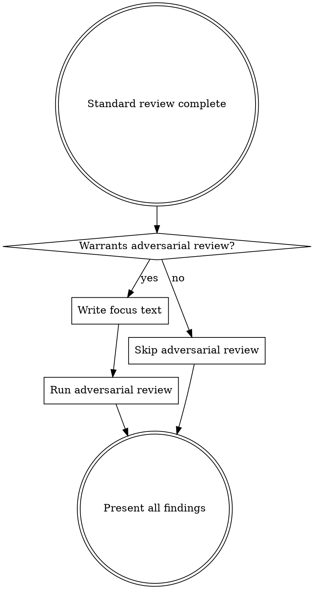

# Codex Review Gate

Cross-model code review using OpenAI Codex at workflow checkpoints.

## When to Use

- **subagent-driven-development (per-task)**: After each task's code quality review passes, before marking the task complete. Reviews the task's commits only.
- **subagent-driven-development (final)**: After all tasks complete and final Claude code review passes, before invoking finishing-a-development-branch. Reviews the full branch diff.

## Step 1: Locate the Companion Script

```bash
find ~/.claude/plugins -name 'codex-companion.mjs' -path '*/openai-codex/*/scripts/*' 2>/dev/null | head -1
```

If not found, tell the user the Codex plugin may need reinstalling and skip the review. Do NOT improvise alternate review flows.

## Step 2: Run Standard Review

**Per-task review** — scope to the task's commits using the base SHA recorded before the task started:

```bash
cd <project-root> && node <script-path> review --json --base <task-base-sha>
```

**Final review** — review the full branch diff (default behavior):

```bash
cd <project-root> && node <script-path> review --json
```

Parse the JSON output and present findings ordered by severity.

## Step 3: Decide Whether to Run Adversarial Review



Two reasons to run adversarial review:

1. **Targeted risk** — you can name a specific technical concern (concurrency, auth, data integrity, an integration edge case).
2. **Approach validation** — the work involved non-trivial design decisions worth a second opinion, even without a specific failure mode in mind. Useful for new abstractions, new patterns, or approaches where simpler alternatives might exist. The useful framing varies case by case.

Skip when the change is mechanical or routine — no design decision to evaluate and no specific risk to probe.

| Warrants adversarial review | Does NOT warrant it |
|----------------------------|---------------------|
| Concurrent state across workers | Simple component rename |
| Auth/input validation/data access | Adding a new UI view |
| Non-obvious design tradeoffs | Straightforward CRUD |
| Integration boundaries between components | Updating dependencies |
| Error handling paths hard to test | Mechanical refactor with no design choices |
| New abstraction or pattern worth a second opinion | Clean standard review on routine work |

```bash
cd <project-root> && node <script-path> adversarial-review --json "<focus text>"
```

### Writing Good Focus Text

The focus text is what makes adversarial review valuable. It must direct Codex at something — either a specific failure mode to stress-test, or a specific design decision to evaluate. Undirected prompts waste the call.

**Targeted-risk prompts** name the mechanism and the failure mode:

- Good: "Check whether the cache invalidation logic handles concurrent writes correctly when two workers update the same key"
- Bad: "Look for bugs"
- Bad: "Check for race conditions" (too vague — which race conditions? between what?)

**Approach-validation prompts** describe the problem, the approach taken, and what aspect you want evaluated (fit with conventions? over-engineering? simpler alternative?):

- Good: "This branch introduces a new X-style abstraction in module Y to solve Z. Evaluate whether this fits the codebase's existing conventions, or whether a simpler approach (e.g., passing config through directly) would be better."
- Good: "We chose to move reconciliation into the worker rather than the coordinator. Is this cleaner than the alternative, or does it create split-brain scenarios we haven't considered?"
- Bad: "Is the code good?" (undirected — nothing for Codex to push on)

Multiple targeted runs on different concerns are fine. One undirected run is not.

## Step 4: Handle Results

Follow the `codex:codex-result-handling` skill patterns:
- Present standard review findings first, adversarial findings separately
- Preserve severity ordering, file paths, and line numbers exactly as reported
- If no issues found, say so explicitly

**Per-task review:** Findings feed into the implementer fix loop. The implementer subagent fixes the issues, then codex re-reviews. Repeat until codex reports no issues. This matches the spec compliance and code quality review loops.

**Final review:** STOP. Ask the user which issues to fix. Do NOT auto-apply fixes, even if they seem obvious. There is no implementer subagent in scope at this point.

## Red Flags

If you catch yourself thinking any of these, STOP:

- "I'll just apply this fix myself during the final review" — Final review has no implementer. Ask the user. Always.
- "I'll just ask Codex to look at everything" — Each run needs directed focus text: either a specific mechanism/failure mode, or a specific design decision to evaluate. Multiple directed runs are fine; undirected ones are not.
- "I'll skip the review since the changes are small" — The workflow requires it. Run it.
- "I'll skip the `--base` flag, the full diff is fine" — Per-task reviews must be scoped to the task's commits only.

## Common Mistakes

| Mistake | Fix |
|---------|-----|
| Auto-fixing issues during final review | STOP and ask user which to fix |
| Skipping fix loop during per-task review | Per-task findings go through implementer fix → re-review loop |
| Running per-task review without `--base` | Pass the task base SHA to scope the review |
| Undirected adversarial review | Each run needs focus text that directs Codex — either a specific mechanism/failure mode, or a specific design decision to evaluate |
| Vague adversarial focus text | Name the mechanism and failure mode, or describe the approach and what aspect to evaluate |
| Hardcoding the script path | Always use the `find` command in Step 1 |
| Skipping review for "trivial" changes | Workflow requires it — run it |
