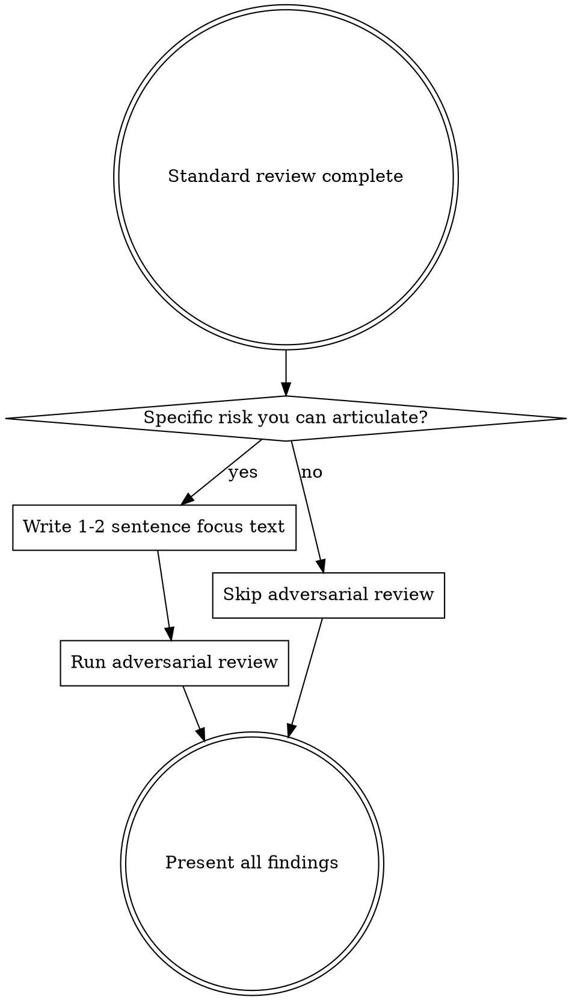

# Codex Review Gate

Cross-model code review using OpenAI Codex at workflow checkpoints.

## When to Use

- **subagent-driven-development**: After all tasks complete and final Claude code review passes, before invoking finishing-a-development-branch

## Step 1: Locate the Companion Script

```bash
find ~/.claude/plugins -name 'codex-companion.mjs' -path '*/openai-codex/*/scripts/*' 2>/dev/null | head -1
```

If not found, tell the user the Codex plugin may need reinstalling and skip the review. Do NOT improvise alternate review flows.

## Step 2: Run Standard Review

Always run this:

```bash
cd <project-root> && node <script-path> review --json
```

Parse the JSON output and present findings ordered by severity.

## Step 3: Decide Whether to Run Adversarial Review



Run adversarial review **only** when you can articulate a specific concern. Examples:

| Warrants adversarial review | Does NOT warrant it |
|----------------------------|---------------------|
| Concurrent state across workers | Simple component rename |
| Auth/input validation/data access | Adding a new UI view |
| Non-obvious design tradeoffs | Straightforward CRUD |
| Integration boundaries between components | Updating dependencies |
| Error handling paths hard to test | Clean standard review |

```bash
cd <project-root> && node <script-path> adversarial-review --json "<focus text>"
```

### Writing Good Focus Text

The focus text is what makes adversarial review valuable. Be specific.

- Good: "Check whether the cache invalidation logic handles concurrent writes correctly when two workers update the same key"
- Bad: "Look for bugs"
- Bad: "Check for race conditions" (too vague — which race conditions? between what?)

## Step 4: Present Results and STOP

Follow the `codex:codex-result-handling` skill patterns:
- Present standard review findings first, adversarial findings separately
- Preserve severity ordering, file paths, and line numbers exactly as reported
- If no issues found, say so explicitly

**After presenting findings, STOP. Ask the user which issues to fix. Do NOT auto-apply fixes, even if they seem obvious.**

## Red Flags

If you catch yourself thinking any of these, STOP:

- "This fix is obvious, I'll just apply it" — Ask first. Always.
- "I'll just run a broad adversarial review for everything" — Focus text must name specific mechanisms. Multiple targeted runs are fine; vague ones are not.
- "I'll skip the review since the changes are small" — The workflow requires it. Run it.

## Common Mistakes

| Mistake | Fix |
|---------|-----|
| Auto-fixing issues after review | STOP and ask user which to fix |
| Vague broad adversarial review | Each run needs specific focus text naming mechanisms and failure modes |
| Vague adversarial focus text | Name the specific mechanism and failure mode |
| Hardcoding the script path | Always use the `find` command in Step 1 |
| Skipping review for "trivial" changes | Workflow requires it — run it |
