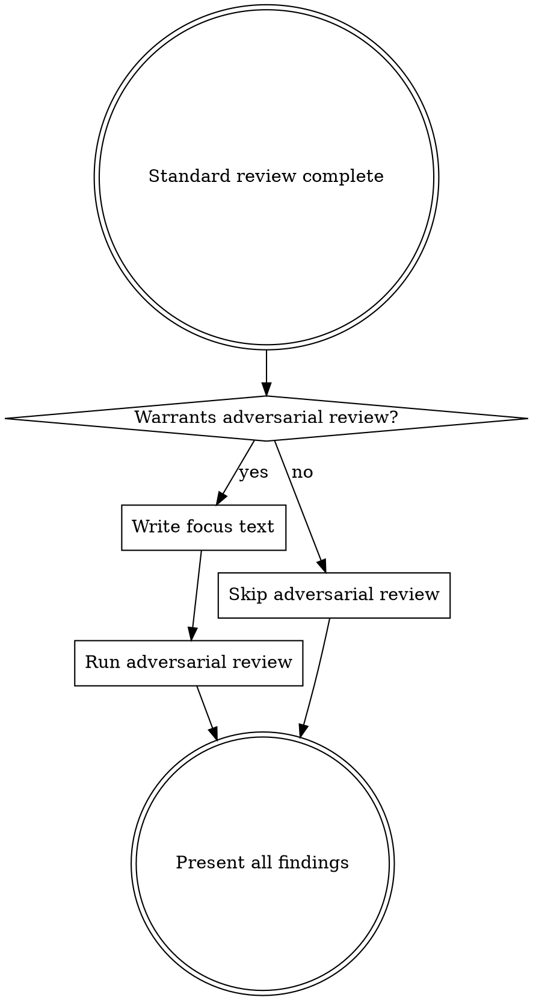

# Codex Review Gate

Cross-model code review using OpenAI Codex. Caller-agnostic primitive — runs the review and surfaces findings; the caller decides what to do with them (auto-fix, fix-loop, escalate to a human, etc.).

## Step 1: Locate the Companion Script

```bash
find ~/.claude/plugins -name 'codex-companion.mjs' -path '*/openai-codex/*/scripts/*' 2>/dev/null | head -1
```

If not found, tell the user the Codex plugin may need reinstalling and skip the review. Do NOT improvise alternate review flows.

## Step 2: Run Standard Review

```bash
cd <project-root> && node <script-path> review --json [--base <sha>]
```

`--base <sha>` scopes the review to commits between `<sha>` and `HEAD`. Omit it to review the full branch diff against the default base. Use whichever the caller specifies — typically a base SHA recorded before the unit of work began (e.g., a worktree's `.ralph-base-sha`, or the merge-base with trunk).

Parse the JSON output and present findings ordered by severity.

## Step 3: Decide Whether to Run Adversarial Review



Two reasons to run adversarial review:

1. **Targeted risk** — you can name a specific technical concern (concurrency, auth, data integrity, an integration edge case).
2. **Approach validation** — the work involved non-trivial design decisions worth a second opinion, even without a specific failure mode in mind. Useful for new abstractions, new patterns, or approaches where simpler alternatives might exist. The useful framing varies case by case.

Skip when the change is mechanical or routine — no design decision to evaluate and no specific risk to probe.

| Warrants adversarial review | Does NOT warrant it |
|----------------------------|---------------------|
| Concurrent state across workers | Simple component rename |
| Auth/input validation/data access | Adding a new UI view |
| Non-obvious design tradeoffs | Straightforward CRUD |
| Integration boundaries between components | Updating dependencies |
| Error handling paths hard to test | Mechanical refactor with no design choices |
| New abstraction or pattern worth a second opinion | Clean standard review on routine work |

```bash
cd <project-root> && node <script-path> adversarial-review --json "<focus text>"
```

### Writing Good Focus Text

The focus text is what makes adversarial review valuable. It must direct Codex at something — either a specific failure mode to stress-test, or a specific design decision to evaluate. Undirected prompts waste the call.

**Targeted-risk prompts** name the mechanism and the failure mode:

- Good: "Check whether the cache invalidation logic handles concurrent writes correctly when two workers update the same key"
- Bad: "Look for bugs"
- Bad: "Check for race conditions" (too vague — which race conditions? between what?)

**Approach-validation prompts** describe the problem, the approach taken, and what aspect you want evaluated (fit with conventions? over-engineering? simpler alternative?):

- Good: "This branch introduces a new X-style abstraction in module Y to solve Z. Evaluate whether this fits the codebase's existing conventions, or whether a simpler approach (e.g., passing config through directly) would be better."
- Good: "We chose to move reconciliation into the worker rather than the coordinator. Is this cleaner than the alternative, or does it create split-brain scenarios we haven't considered?"
- Bad: "Is the code good?" (undirected — nothing for Codex to push on)

Multiple targeted runs on different concerns are fine. One undirected run is not.

## Step 4: Present Findings

Follow the `codex:codex-result-handling` skill patterns:
- Present standard review findings first, adversarial findings separately
- Preserve severity ordering, file paths, and line numbers exactly as reported
- If no issues found, say so explicitly

Hand the findings back to the caller. The caller's workflow decides what happens next (auto-fix, fix-loop, escalate to a human, defer). This skill does not.

## Red Flags

If you catch yourself thinking any of these, STOP:

- "I'll just ask Codex to look at everything" — Each adversarial run needs directed focus text: either a specific mechanism/failure mode, or a specific design decision to evaluate. Multiple directed runs are fine; undirected ones are not.
- "I'll skip the review since the changes are small" — The caller invoked the gate. Run it.
- "I'll decide what to do with the findings" — The caller's workflow owns that. Present findings; don't apply policy here.

## Common Mistakes

| Mistake | Fix |
|---------|-----|
| Undirected adversarial review | Each run needs focus text that directs Codex — either a specific mechanism/failure mode, or a specific design decision to evaluate |
| Vague adversarial focus text | Name the mechanism and failure mode, or describe the approach and what aspect to evaluate |
| Hardcoding the script path | Always use the `find` command in Step 1 |
| Skipping review for "trivial" changes | The caller invoked the gate — run it |
| Applying caller-specific policy here | This skill returns findings; the caller decides what to do with them |
