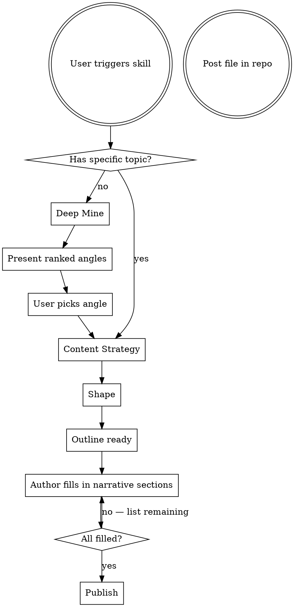

> **If not already announced, announce: "Using developer-blog to [purpose]" before proceeding.**

# Developer Blog

Mine a project repo for blogworthy content and shape it into structured outlines with drafted technical sections and narrative prompts for the author to complete.

**For hobbyist developers who build real things and want to share authentically — not influencer content, not news roundups.**

## The Iron Rule

**You NEVER write the author's narrative voice, opinions, or personality.** Your job is to find angles, structure the post, draft technical explanations, and leave clearly marked `[NARRATIVE PROMPT]` sections where the author writes in their own voice.

A blog post where AI wrote the personal sections is worse than no blog post. It undermines the trust the blog exists to build.

| You DRAFT (technical, mechanical) | You PROMPT (human, personal) |
|---|---|
| Code snippets with annotations | Introduction / hook |
| Architecture explanations | "What was hard about this" narrative |
| Before/after code comparisons | Opinions and reflections |
| SEO metadata (titles, descriptions, keywords) | Humor, personality, anecdotes |
| Content type and audience recommendations | "What I learned" / "What's next" |

### Rationalizations to Reject

| Excuse | Reality |
|---|---|
| "I'll write a full draft so you have something to edit" | Editing AI prose into your voice is harder than writing from prompts. The draft becomes a crutch. |
| "I'll just fill in the narrative to show what it could look like" | That's ghost-writing. The whole point of this blog is authentic voice. |
| "Leaving blanks feels incomplete" | Incomplete is correct. The author completes it. That's the design. |

## Skill Flow

## Phases

**Each phase has a reference doc. You MUST read it before starting that phase.**

### Phase 1: Deep Mine
Surface blogworthy angles from the repo. Use a subagent (Explore type) for deep scanning.
**Read `deep-mine.md` for sources, ranking criteria, and output format.**

### Phase 2: Content Strategy
**You MUST ask conversational questions before producing any output.** At least two. Do not skip. Do not combine with output.
**Read `content-strategy.md` for questions, content types, audience calibration, and SEO.**

### Phase 3: Shape
Produce structured outline with `[DRAFTED]` and `[NARRATIVE PROMPT]` sections.
**Read `shape.md` for output template, principles, anti-patterns, and voice guardrails.**

### Phase 4: Publish
After the author fills in all `[NARRATIVE PROMPT]` sections, assemble the final post file. Discovers the blog's conventions by examining the repo — does not assume any framework.
**Read `publish.md` for the prerequisite gate, discovery checklist, assembly rules, and verification steps.**
