# Linear Dependency Visualization

Generate Graphviz dependency graphs from Linear issues. Read-only — run without confirmation.

## When to Use

- User asks to "visualize dependencies", "show the graph", "what's blocking progress"
- User wants to see issue relationships across projects in an initiative
- User asks for a dependency diagram or blocking chain

## Scripts Location

All scripts live in `~/.claude/skills/linear-visualize/`. Run with absolute paths or `cd` there first. Output files (`manifest.json`, `graph.dot`, `graph.svg`) are written to the current working directory.

## Pipeline

```dot
digraph pipeline {
    rankdir=LR;
    node [shape=box];

    context [label="Read initiative/project\nfrom CLAUDE.md ## Linear" shape=box];
    scope [label="Initiative or\nsingle project?" shape=diamond];
    fetch_init [label="fetch-issues.js\n--initiative \"Name\"" shape=plaintext];
    fetch_proj [label="fetch-issues.js\n--project \"Name\"" shape=plaintext];
    labels [label="Edit manifest labels?\n(ask user)" shape=diamond];
    edit [label="Edit label fields\nin manifest.json" shape=box];
    render [label="render-graph.js\n--render" shape=plaintext];
    open [label="open graph.svg" shape=plaintext];

    context -> scope;
    scope -> fetch_init [label="initiative"];
    scope -> fetch_proj [label="project"];
    fetch_init -> labels;
    fetch_proj -> labels;
    labels -> edit [label="yes"];
    labels -> render [label="no"];
    edit -> render;
    render -> open;
}
```



### Step 1: Find the scope

Read the current project's `CLAUDE.md` for the `## Linear` section. Use `--initiative` when the user wants a cross-project view. Use `--project` for a single project.

### Step 2: Fetch issues

```bash
bun ~/.claude/skills/linear-visualize/fetch-issues.js --initiative "Initiative Name"
```

Writes `manifest.json` with all issues and their `blocks`/`blockedBy` relations.

### Step 3: (Optional) Clean up labels

Ask the user if they want concise labels. If yes, edit the `label` fields in `manifest.json` to 2-4 word descriptions before rendering.

### Step 4: Render and open

```bash
bun ~/.claude/skills/linear-visualize/render-graph.js --render && open graph.svg
```

## Quick Reference

| Flag | Script | Purpose |
|------|--------|---------|
| `--initiative "Name"` | fetch-issues.js | Fetch all projects in an initiative |
| `--project "Name"` | fetch-issues.js | Fetch a single project |
| `--output path` | fetch-issues.js | Output file (default: `manifest.json`) |
| `--input path` | render-graph.js | Input file (default: `manifest.json`) |
| `--output path` | render-graph.js | DOT output file (default: `graph.dot`) |
| `--render` | render-graph.js | Invoke Graphviz to produce image |
| `--format fmt` | render-graph.js | Image format: `svg` (default) or `png` |

## Prerequisites

- Graphviz must be installed: `brew install graphviz`
- The `linear` CLI must be authenticated: `linear auth login`

## Common Mistakes

- **Inventing flags** — there is no `--team` flag. Only `--initiative` or `--project`.
- **Forgetting `--output`** — without it, `manifest.json` and `graph.dot` are written to the current working directory.
- **Skipping the manifest step** — the pipeline is always fetch → manifest.json → render. You cannot pipe directly.
