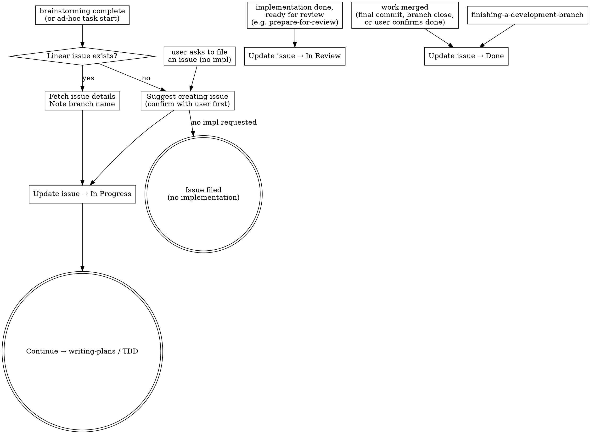

# Linear Workflow

Every non-trivial feature or bug fix should have a corresponding Linear issue before code is written. This skill ensures issues are created and updated at the right moments.

## CLI vs MCP Tools

**Prefer the `linear` CLI over MCP tools.** The CLI provides filtering, JSON output, batch operations, relation management, and git-aware commands that the MCP wrappers don't expose. It also avoids permission fatigue (one binary approval vs per-request prompts).

For CLI command reference and usage, see the **linear-cli** plugin skill. This skill focuses on *when* and *why* to interact with Linear, not *how*. **If you need to perform an operation not covered here** (cycles, attachments, custom views, unusual filters, etc.), consult the **linear-cli** plugin skill for the full command surface before falling back to MCP.

**When MCP tools are acceptable:**
- `linear` CLI is not installed (`linear --version` fails)
- Simple single-issue lookups when you already have the issue ID

## Integration with Superpowers Workflow

This skill activates at three points in the superpowers flow:

### Entry Point 1: Starting Work

After brainstorming completes and the user commits to building, or when starting ad-hoc work:

1. **Check for duplicates** (see "Duplicate Prevention" below)
2. If existing issue found → fetch details with `linear issue view ID --json`, note the branch name and acceptance criteria
3. If no match → suggest creating one. **Confirm all details with the user before running any CLI command.**
4. **Move the issue to "In Progress"** with `linear issue update ID --state "In Progress"` — but read the current state first via `linear issue view ID --json` and branch on it:
   - Already `In Progress`: skip the write. Another actor (e.g., the spec-queue orchestrator) may have pre-transitioned at dispatch; a second write is unnecessary noise.
   - `Triage`, `Backlog`, `Todo`, `Approved`, or `In Review`: transition to `In Progress`. The `In Review` case is legitimate — when resuming implementation to address review feedback, the board must reflect that code is changing again (ralph v2's DAG rule treats `In Review` as resolved-enough-to-build-on, so downstream dispatch races if state lags behind reality).
   - `In Design`: stop and ask. The state signals that an interactive design session was started but didn't conclude. Starting implementation without first concluding the design (→ `Approved`) means moving forward without a finalized spec. Prompt the user to choose: resume `/ralph-spec`, mark `Approved` and proceed, or abandon back to `Todo`/`Backlog`. See the `In Design` state subsection for context.
   - `Done` or `Canceled`: stop and ask the user. These are terminal; reopening warrants explicit confirmation.

Then continue to writing-plans or TDD as normal.

### Entry Point 2: Filing an Issue (No Implementation)

When the user asks to create or file an issue without starting implementation:

1. **Check for duplicates first** (see "Duplicate Prevention" below)
2. Follow all conventions in "Creating Issues" below (title format, project, priority, status)
3. **Confirm details with the user before running any CLI command**
4. Stop after filing — do not continue to writing-plans or TDD

### Entry Point 3: Handoff or Completion

Two transitions land here, each with its own trigger:

- **In Progress → In Review** when implementation is done and the work is ready for human review. This is what `prepare-for-review` invokes at the end of an autonomous session. Command: `linear issue update ID --state "In Review"`.
- **In Progress or In Review → Done** when the work has shipped — merged via `finishing-a-development-branch`, a project-local closing skill, a final commit on main, or user confirmation. Command: `linear issue update ID --state "Done"`.

If implementation deviated from acceptance criteria, update the issue description too.

These transitions are independent of how the work was integrated. Don't wait for a branch-closing skill if the work is already merged to main. Before writing, check the current state and skip if it already matches the target — the transitions here go toward terminal states and repeated writes are just noise.

### Active Work Status

When implementation begins on an issue (after Entry Point 1), update its status to "In Progress". This keeps the board accurate — anyone looking at Linear can see what's actively being worked on.

Don't set "In Progress" when merely filing an issue (Entry Point 2) or during exploratory/brainstorming phases before committing to build.

## The "In Design" State

The Linear workflow in this workspace places `In Design` between `Todo` and `Approved`:

`Todo → In Design → Approved → In Progress → In Review → Done`

`In Design` signals that **a human has picked up the issue and is actively running an interactive design or spec session** — typically `/ralph-spec`. It is distinct from `In Progress`, which is reserved for *implementation* (often autonomous, dispatched by `/ralph-start`).

`/ralph-start`'s queue builder deliberately does **not** dispatch issues in `In Design`. The state sits outside the autonomous queue so that a half-formed design doesn't get picked up for implementation.

### Transitions involving `In Design`

| From | To | Trigger |
|---|---|---|
| `Todo` | `In Design` | A human opens an interactive design session on the ticket (typically `/ralph-spec`, which transitions automatically at session start). Don't write `In Design` directly from this skill. |
| `In Design` | `Approved` | The interactive design session concludes successfully and the spec is ready for autonomous dispatch. `/ralph-spec` does this in its finalization step. Don't write `Approved` directly from this skill. |
| `In Design` | `Todo` or `Backlog` | The design session is abandoned without producing an Approved spec. The human resets the issue manually — back to `Todo` if it remains actionable, `Backlog` if the scope needs more thinking. |

### Anti-pattern

`In Design` is **not** for autonomous implementation work — that's `In Progress`. The two states are semantically distinct:

- `In Design` = *design* in flight (interactive, human-driven dialogue).
- `In Progress` = *implementation* in flight (autonomous or interactive coding work).

Don't transition an issue to `In Design` to mean "I'm working on it" when the work is actually implementation. And don't dispatch an `In Design` issue for autonomous coding — `/ralph-start` already prevents this, but the same rule applies if you're writing code directly: complete the design (move to `Approved`) before transitioning to `In Progress`.

## Creating Issues

When proposing a new issue, confirm these with the user:

- **Title**: Short, direct statement of the task. Start with an imperative verb when the action is clear. Scannable at a glance in board/list views — no ceremony or prefixes.
  - Good: "Add inline stats input to swap step for unknown opponent cards"
  - Good: "Auto-approve compound Bash cd commands when target matches cwd"
  - Bad: "Done when swap step handles unknown opponent cards" (front-loads ceremony)
  - Bad: "Fix swap step" (too vague to act on)
  - Bad: "[FE] Swap step improvements" (use labels, not title prefixes)
- **Project**: Assign to the correct project (see Workspace Context below)
- **Priority**: Bugs → Urgent. Features → Medium.
- **Labels**: `Bug` for bugs. Keep minimal otherwise.
- **Assignee**: Never set. The user assigns issues to themselves manually when they're ready to pick them up.
- **Status**: "Todo" if the work is actionable now — clear enough to implement and reasonably scoped. "Backlog" if it's large, vague, or not yet thought through. Never "Triage" — that's for external intake, not deliberate dev work.
- **Dependencies**: If the new issue is blocked by another issue, set `blocked-by` at creation time via `linear issue relation add`. When creating multiple related issues in a batch, set dependencies between them immediately — don't leave it as a follow-up.
- **Follow-ups**: When filing an issue that came out of work on another issue (discovered during implementation, review, testing, or scope-cut from a parent issue), link it to the originating issue at creation time via `linear issue relation add`. Pick the relation that reflects the actual relationship — `blocked-by`/`blocks` when there's a real sequencing dependency, `related` otherwise. The link makes provenance visible; future readers shouldn't have to reconstruct where a follow-up came from.

After creation, use Linear's auto-generated branch name (e.g. `eng-30-description-slug`) for `git checkout -b`. The `linear issue start` command does this automatically — it creates the branch and marks the issue as started.

## Duplicate Prevention

**Before creating any issue**, scan for existing issues that overlap:

1. Query issues filtered by the target **project** using `linear issue query --search "term" --json` or scoped with `--team`. Cross-check an empty result by re-running without `--search` and filtering in jq — empty `--search` output has been a jq-path bug before, not a true absence.
2. Scan titles and descriptions for overlap with the issue you're about to create. Look for:
   - Same feature or data need described differently (e.g., "Recipe data pipeline" vs "Recipe data loads from msgpack")
   - Issues that would be superseded by the new one (e.g., an XIVAPI-based approach replaced by a msgpack approach)
   - Completed work that already covers the acceptance criteria
3. If you find overlapping issues:
   - **Exact duplicate:** Don't create. Point the user to the existing issue.
   - **Superseded by new approach:** Suggest canceling the old issue (mark as duplicate of the new one) when creating.
   - **Partially overlapping:** Call it out and let the user decide whether to merge, split, or keep both.
   - **Already done but not marked Done:** Suggest closing it.

This applies to all entry points — starting work, filing issues, and batch-creating multiple issues.

## Autonomous Sessions

Some sessions run without a human in the loop — e.g., the spec-queue orchestrator (ralph v2) dispatches autonomous `claude -p` sessions against pre-approved issues. In that context:

- **Entry Point 1 does not run.** The orchestrator pre-selects the issue, pre-creates the worktree, and pre-transitions state to `In Progress` before dispatch. The agent reads its issue ID from the prompt and begins implementation directly. There is no "starting work" step to execute. The orchestrator queries `Approved` issues only — issues in `In Design` are deliberately skipped, since they represent in-flight interactive design work, not autonomous-ready implementation work.
- **Entry Point 2 (filing follow-ups) proceeds without confirmation.** Use the defaults in "Creating Issues" below: project per workspace context, priority Urgent for bugs / Medium for features, status `Backlog` when scope is vague or `Todo` when actionable. Always link back to the originating issue via `linear issue relation add` so provenance is preserved for later human review.
- **Entry Point 3 targets `In Review`, not `Done`.** Autonomous sessions hand off for human review. The `Done` transition is the user's when they merge the branch.
- **Before filing, run the duplicate check.** Run both:
  1. Linear search via `linear issue query --search "term" --json` (per "Duplicate Prevention" above). If the result is empty, re-run without `--search` and filter in jq before trusting it — empty `--search` output has been a jq-path bug before, not a true absence.
  2. `git log main --oneline --grep "term"` — the worktree can lag `main` by hours and a recently-shipped fix may be invisible locally.

  If the check finds a match: exact duplicate → don't create. Partial overlap → file the new issue, add a comment on both linking them so the human reviewer can merge or adjust. Never block waiting on a "let the user decide" prompt.

## When This Does NOT Apply

- Session start — don't scan Linear automatically
- Trivial changes (typo fixes, formatting, config tweaks)
- Exploratory work the user hasn't committed to

## Workspace Context

Team, initiative, and project context lives in each project's CLAUDE.md under a `## Linear` section. Look there to determine which team, initiative, and project to assign issues to.

## Quick Reference

- Priority values: 0=None, 1=Urgent, 2=High, 3=Medium, 4=Low
- Statuses use American spelling: "Canceled" (one 'l')
- When canceling an issue, add a comment explaining why the work was decided against. "Why we didn't" is harder to reconstruct later than "why we did."
- Relation types: `blocked-by`, `blocks`, `duplicate`, `related`
- One issue = one branch = one PR — don't bundle unrelated work
- For CLI command details, flags, and output formats: see the **linear-cli** plugin skill
