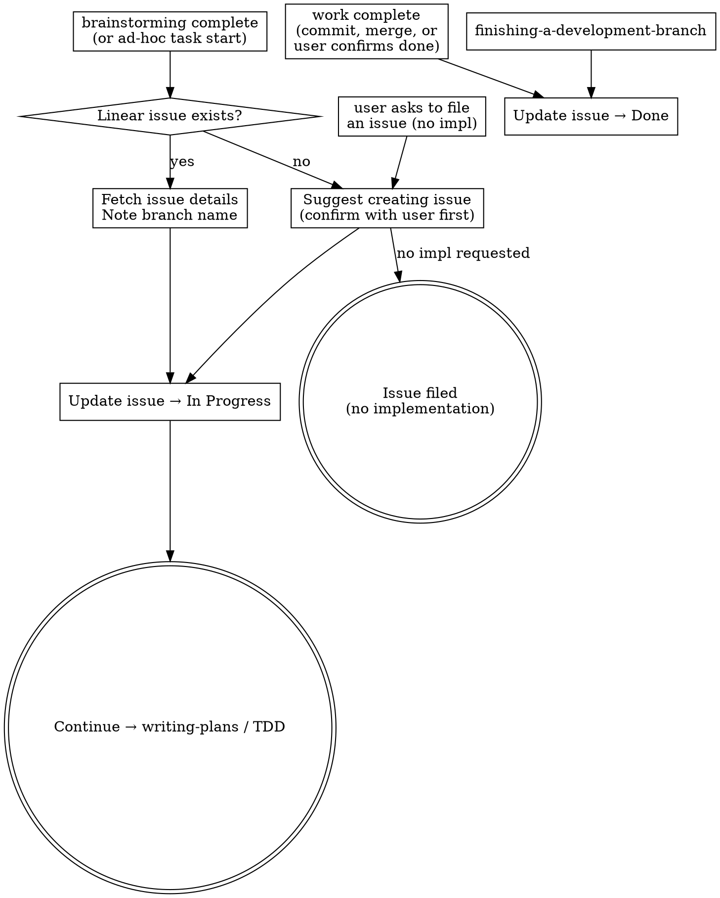

# Linear Workflow

Every non-trivial feature or bug fix should have a corresponding Linear issue before code is written. This skill ensures issues are created and updated at the right moments.

## CLI vs MCP Tools

**Prefer the `linear` CLI over MCP tools.** The CLI provides filtering, JSON output, batch operations, relation management, and git-aware commands that the MCP wrappers don't expose. It also avoids permission fatigue (one binary approval vs per-request prompts).

For CLI command reference and usage, see the **linear-cli** plugin skill. This skill focuses on *when* and *why* to interact with Linear, not *how*.

**When MCP tools are acceptable:**
- `linear` CLI is not installed (`linear --version` fails)
- Simple single-issue lookups when you already have the issue ID

## Integration with Superpowers Workflow

This skill activates at three points in the superpowers flow:

### Entry Point 1: Starting Work

After brainstorming completes and the user commits to building, or when starting ad-hoc work:

1. **Check for duplicates** (see "Duplicate Prevention" below)
2. If existing issue found → fetch details with `linear issue view ID --json`, note the branch name and acceptance criteria
3. If no match → suggest creating one. **Confirm all details with the user before running any CLI command.**
4. **Update the issue status to "In Progress"** with `linear issue update ID --state "In Progress"`.

Then continue to writing-plans or TDD as normal.

### Entry Point 2: Filing an Issue (No Implementation)

When the user asks to create or file an issue without starting implementation:

1. **Check for duplicates first** (see "Duplicate Prevention" below)
2. Follow all conventions in "Creating Issues" below (title format, project, priority, status)
3. **Confirm details with the user before running any CLI command**
4. Stop after filing — do not continue to writing-plans or TDD

### Entry Point 3: Completing Work

When work on a Linear issue is complete — whether via `finishing-a-development-branch`, a final commit on main, or the user confirming the feature is done — update the associated Linear issue status to "Done" with `linear issue update ID --state "Done"`. If implementation deviated from acceptance criteria, update the issue description too.

This entry point is independent of how the work was integrated. Don't wait for `finishing-a-development-branch` if the work is already merged or committed to main.

### Active Work Status

When implementation begins on an issue (after Entry Point 1), update its status to "In Progress". This keeps the board accurate — anyone looking at Linear can see what's actively being worked on.

Don't set "In Progress" when merely filing an issue (Entry Point 2) or during exploratory/brainstorming phases before committing to build.

## Creating Issues

When proposing a new issue, confirm these with the user:

- **Title**: Short, direct statement of the task. Start with an imperative verb when the action is clear. Scannable at a glance in board/list views — no ceremony or prefixes.
  - Good: "Add inline stats input to swap step for unknown opponent cards"
  - Good: "Auto-approve compound Bash cd commands when target matches cwd"
  - Bad: "Done when swap step handles unknown opponent cards" (front-loads ceremony)
  - Bad: "Fix swap step" (too vague to act on)
  - Bad: "[FE] Swap step improvements" (use labels, not title prefixes)
- **Project**: Assign to the correct project (see Workspace Context below)
- **Priority**: Bugs → Urgent. Features → Medium.
- **Labels**: `Bug` for bugs. Keep minimal otherwise.
- **Assignee**: Never set. Sean assigns issues to himself manually when he's ready to pick them up.
- **Status**: "Todo" if the work is actionable now — clear enough to implement and reasonably scoped. "Backlog" if it's large, vague, or not yet thought through. Never "Triage" — that's for external intake, not deliberate dev work.
- **Dependencies**: If the new issue is blocked by another issue, set `blocked-by` at creation time via `linear issue relation add`. When creating multiple related issues in a batch, set dependencies between them immediately — don't leave it as a follow-up.

After creation, use Linear's auto-generated branch name (e.g. `eng-30-description-slug`) for `git checkout -b`. The `linear issue start` command does this automatically — it creates the branch and marks the issue as started.

## Duplicate Prevention

**Before creating any issue**, scan for existing issues that overlap:

1. Query issues filtered by the target **project** using `linear issue query --search "term" --json` or scoped with `--team`.
2. Scan titles and descriptions for overlap with the issue you're about to create. Look for:
   - Same feature or data need described differently (e.g., "Recipe data pipeline" vs "Recipe data loads from msgpack")
   - Issues that would be superseded by the new one (e.g., an XIVAPI-based approach replaced by a msgpack approach)
   - Completed work that already covers the acceptance criteria
3. If you find overlapping issues:
   - **Exact duplicate:** Don't create. Point the user to the existing issue.
   - **Superseded by new approach:** Suggest canceling the old issue (mark as duplicate of the new one) when creating.
   - **Partially overlapping:** Call it out and let the user decide whether to merge, split, or keep both.
   - **Already done but not marked Done:** Suggest closing it.

This applies to all entry points — starting work, filing issues, and batch-creating multiple issues.

## When This Does NOT Apply

- Session start — don't scan Linear automatically
- Trivial changes (typo fixes, formatting, config tweaks)
- Exploratory work the user hasn't committed to

## Workspace Context

Team, initiative, and project context lives in each project's CLAUDE.md under a `## Linear` section. Look there to determine which team, initiative, and project to assign issues to.

## Quick Reference

- Priority values: 0=None, 1=Urgent, 2=High, 3=Medium, 4=Low
- Statuses use American spelling: "Canceled" (one 'l')
- When canceling an issue, add a comment explaining why the work was decided against. "Why we didn't" is harder to reconstruct later than "why we did."
- Relation types: `blocked-by`, `blocks`, `duplicate`, `related`
- One issue = one branch = one PR — don't bundle unrelated work
- For CLI command details, flags, and output formats: see the **linear-cli** plugin skill
