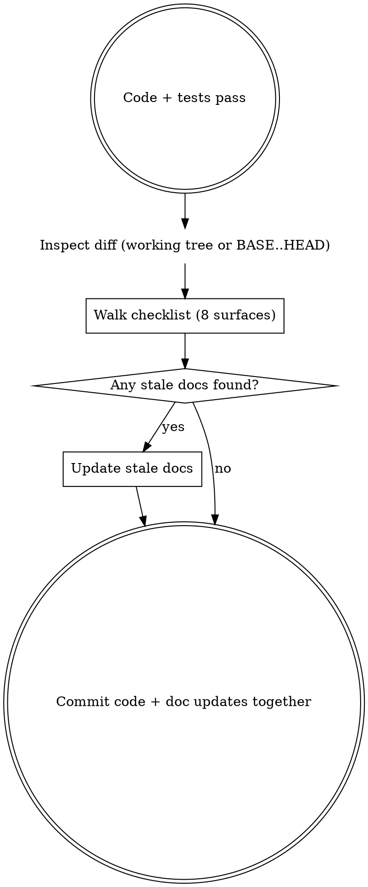

# Update Stale Docs

## Overview

Systematic checklist for finding and updating all documentation affected by a code change. Without this, agents find *some* stale docs via ad-hoc searching but reliably miss others — especially persistent memory and inline comments.

**Core principle:** The diff tells you what changed. The sweep tells you what else knows about it.

## When to Use

- After code + tests pass, before the final commit
- After refactoring that changes file responsibilities or component relationships
- After a bug fix that corrects behavior previously described in docs

**Skip for:** Pure test additions, dependency version bumps, formatting-only changes.

## The Checklist

**Scope the diff.** By default, inspect the working tree — the pre-commit use case:

```bash
git diff --stat
```

When invoked with a base SHA argument (`--base <sha>`), scope to committed branch work instead:

```bash
git diff --stat "$BASE" HEAD
```

Use the base-SHA form when work is already committed (e.g. when `prepare-for-review` invokes this skill after the final commit). The working-tree form is empty on a clean branch and would make the sweep trivially "no changes."

Then check each surface below. For each, ask: *does this describe behavior, structure, or relationships that my change affected?*



### 1. ABOUTME comments

Check ABOUTMEs in three rings:
1. **Changed files** — does the ABOUTME still describe the file's current role?
2. **Consumers/callers** of changed files — do they mention old relationships?
3. **Test files** for changed modules — do test ABOUTMEs list the functions they now cover?

```bash
grep -rn "ABOUTME" src/ tests/    # find all ABOUTME comments
```

### 2. Inline comments in the diff

Run the full hunk diff at the same scope (not `--stat`, which is a summary only) — `git diff` for the working-tree mode, or `git diff "$BASE" HEAD` when invoked with `--base <sha>`. Read every comment visible in the output. Do any describe old behavior, old callers, or old data flow? Fix them.

### 3. Decision docs

Search `docs/decisions/` (or equivalent) for keywords matching your changed concepts — function names, component names, architectural terms.

```bash
grep -rl "ComponentName\|functionName" docs/decisions/
```

Read any matches. If the decision doc describes the old approach as current, update the relevant section.

### 4. Design specs and implementation plans

- **Completed plans:** Mark all checkboxes as done (`- [x]`). A plan with unchecked boxes after implementation confuses future agents.
- **Shipped specs:** Leave as historical record unless they contain factually incorrect information. Specs describe intent at design time — they don't need to track implementation drift.

### 5. CLAUDE.md

Check sections about: tech stack, project structure, build commands, conventions. New dependencies, build steps, or conventions must be reflected here.

### 6. Persistent memory (MEMORY.md + linked files)

**This is the most commonly missed surface.** Memory files live outside the repo in `~/.claude/projects/.../memory/`. Check:
- Project structure entries
- Tech stack descriptions  
- Design decision summaries
- "What's Next" or roadmap entries (is the completed work still listed as future?)
- **Numeric claims** (test counts, file counts, performance baselines) — these drift silently

### 7. README

If the project has one, check: architecture diagrams, setup instructions, component inventories, build commands.

### 8. Related source files not in the diff

Files you *didn't* change may have comments or doc blocks that reference entities you renamed, moved, or extracted. Build a grep from your diff:

```bash
grep -rn "OldName\|movedFunction\|extractedHelper" src/ tests/
```

Read every match. This surface is easy to gloss over — actually run the grep and read the results.

## Verification Rule

**Before claiming any doc is stale, confirm the file exists and read the actual content.** Do not assume a doc exists based on convention or memory. False positives (updating non-existent docs) are worse than false negatives (missing a stale doc).

## Red Flags — You're Skipping the Sweep

- "Tests pass, I'm done"
- "I'll update docs in a follow-up"
- "It's just a small change"
- "The docs are close enough"
- Committing without checking any of the 8 surfaces above

Follow-up doc tasks don't get done. Update now or it stays stale.

## Quick Reference

```
After code + tests pass, before commit (or post-commit with `--base <sha>`):
1. git diff --stat [BASE..HEAD] → what changed?
2. ABOUTME comments             → still accurate?
3. Inline comments in diff      → describe current behavior?
4. docs/decisions/              → grep for changed concepts
5. Specs + plans                → completed? mark done
6. CLAUDE.md                    → tech stack, structure current?
7. MEMORY.md + memory files     → project state, decisions current?
8. README                       → setup, architecture current?
9. Related source files         → references to renamed/moved things?
→ Update all stale docs, then commit together
```
